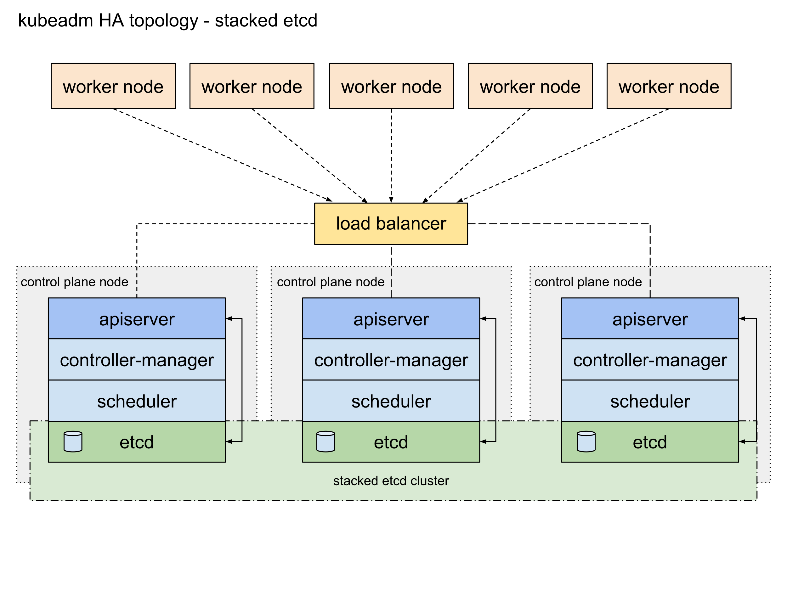
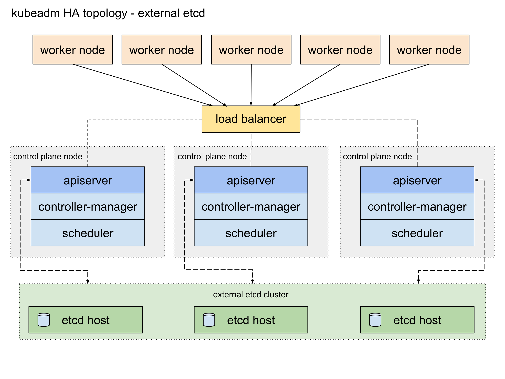
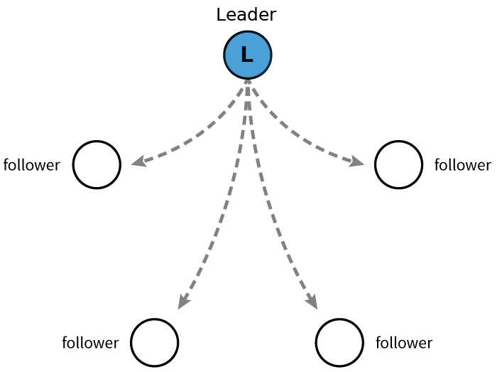
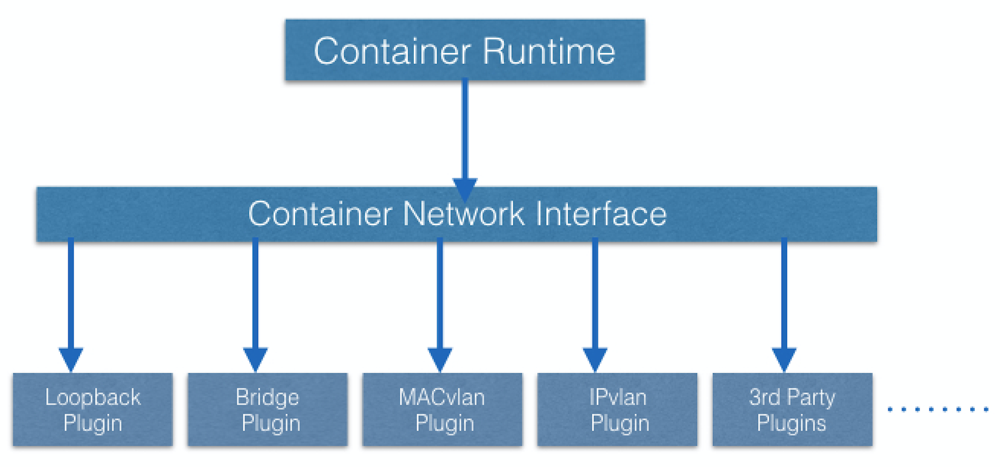

# Chapter 4. Kubernetes Architecture

In this chapter, we will explore the **Kubernetes architecture**, the components of a **control plane node**, the role of the **worker nodes**, the cluster state management with **etcd** and the network setup requirements. We will also learn about the **Container Network Interface (CNI)**, as Kubernetes' network specification.

By the end of this chapter, you should be able to:

* Discuss the Kubernetes architecture.
* Explain the different components of the control plane and worker nodes.
* Discuss cluster state management with etcd.
* Review the Kubernetes network setup requirements.

##  Kubernetes Architecture

At a very high level, Kubernetes is a cluster of compute systems categorized by their distinct roles:

* One or more control plane nodes
* One or more worker nodes (optional, but recommended).

###  Control Plane Node Overview

El nodo del plano de control proporciona un entorno de ejecución para los agentes del plano de control responsables de administrar el estado de un clúster de Kubernetes y es el cerebro detrás de todas las operaciones dentro del clúster. Los componentes del plano de control son agentes con roles muy distintos en la gestión del clúster. Para comunicarse con el clúster de Kubernetes, los usuarios envían solicitudes al plano de control a través de una herramienta de interfaz de línea de comandos (CLI), un panel de interfaz de usuario web (IU web) o una interfaz de programación de aplicaciones (API).

Es importante mantener el plano de control funcionando a toda costa. La pérdida del plano de control puede generar tiempo de inactividad, lo que provoca la interrupción del servicio a los clientes, con la posible pérdida de negocio. Para garantizar la tolerancia a fallas del plano de control, se pueden agregar réplicas de nodos del plano de control al clúster, configuradas en modo de alta disponibilidad (HA). Si bien solo uno de los nodos del plano de control está dedicado a administrar activamente el clúster, los componentes del plano de control permanecen sincronizados en las réplicas del nodo del plano de control. Este tipo de configuración agrega resistencia al plano de control del clúster, en caso de que falle el nodo del plano de control activo.

Para conservar el estado del clúster de Kubernetes, todos los datos de configuración del clúster se guardan en un almacén de clave-valor distribuido que solo contiene datos relacionados con el estado del clúster, sin datos generados por la carga de trabajo del cliente. El almacén de clave-valor se puede configurar en el nodo del plano de control (topología apilada) o en su host dedicado (topología externa) para ayudar a reducir las posibilidades de pérdida del almacén de datos al desacoplarlo de los otros agentes del plano de control.

En la topología de almacén de clave-valor apilada, las réplicas de nodos del plano de control de alta disponibilidad también garantizan la resiliencia del almacén de clave-valor. Sin embargo, ese no es el caso con la topología de almacenamiento clave-valor externo, donde los hosts de almacenamiento clave-valor dedicados deben replicarse por separado para HA, una configuración que introduce la necesidad de hardware adicional y, por lo tanto, costos operativos adicionales.

###  Control Plane Node  Components

A control plane node runs the following essential control plane components and agents:

* API Server
* Scheduler
* Controller Managers
* Key-Value Data Store.

In addition, the control plane node runs:

* Container Runtime
* Node Agent
* Proxy
* Optional addons for cluster-level monitoring and logging.

###  Control Plane Node  Components: API Server

All the administrative tasks are coordinated by the kube-apiserver, a central control plane component running on the control plane node. The API Server intercepts RESTful calls from users, administrators, developers, operators and external agents, then validates and processes them. During processing the API Server reads the Kubernetes cluster's current state from the key-value store, and after a call's execution, the resulting state of the Kubernetes cluster is saved in the key-value store for persistence. The API Server is the only control plane component to talk to the key-value store, both to read from and to save Kubernetes cluster state information - acting as a middle interface for any other control plane agent inquiring about the cluster's state.

The API Server is highly configurable and customizable. It can scale horizontally, but it also supports the addition of custom secondary API Servers, a configuration that transforms the primary API Server into a proxy to all secondary, custom API Servers, routing all incoming RESTful calls to them based on custom defined rules.

###  Control Plane Node  Components: Scheduler

The role of the kube-scheduler is to assign new workload objects, such as pods encapsulating containers, to nodes - typically worker nodes. During the scheduling process, decisions are made based on current Kubernetes cluster state and new workload object's requirements. The scheduler obtains from the key-value store, via the API Server, resource usage data for each worker node in the cluster. The scheduler also receives from the API Server the new workload object's requirements which are part of its configuration data. Requirements may include constraints that users and operators set, such as scheduling work on a node labeled with disk==ssd key-value pair. The scheduler also takes into account Quality of Service (QoS) requirements, data locality, affinity, anti-affinity, taints, toleration, cluster topology, etc. Once all the cluster data is available, the scheduling algorithm filters the nodes with predicates to isolate the possible node candidates which then are scored with priorities in order to select the one node that satisfies all the requirements for hosting the new workload. The outcome of the decision process is communicated back to the API Server, which then delegates the workload deployment with other control plane agents.

The scheduler is highly configurable and customizable through scheduling policies, plugins, and profiles. Additional custom schedulers are also supported, then the object's configuration data should include the name of the custom scheduler expected to make the scheduling decision for that particular object; if no such data is included, the default scheduler is selected instead.

A scheduler is extremely important and complex in a multi-node Kubernetes cluster, while in a single-node Kubernetes cluster possibly used for learning and development purposes, the scheduler's job is quite simple.

### Control Plane Node Components: Controller Managers
The controller managers are components of the control plane node running controllers or operator processes to regulate the state of the Kubernetes cluster. Controllers are watch-loop processes continuously running and comparing the cluster's desired state (provided by objects' configuration data) with its current state (obtained from the key-value store via the API Server). In case of a mismatch corrective action is taken in the cluster until its current state matches the desired state.

The kube-controller-manager runs controllers or operators responsible to act when nodes become unavailable, to ensure container pod counts are as expected, to create endpoints, service accounts, and API access tokens.

The cloud-controller-manager runs controllers or operators responsible to interact with the underlying infrastructure of a cloud provider when nodes become unavailable, to manage storage volumes when provided by a cloud service, and to manage load balancing and routing.

### Control Plane Node Components: Key-Value Data Store

[etcd](https://etcd.io/) is an open source project under [CLoud Native Computing Foundation](https://www.cncf.io/) (CNCF). etcd is a strongly consistent, distributed **key-value data store** used to persist a Kubernetes cluster's state. New data is written to the data store only by appending to it, data is never replaced in the data store. Obsolete data is compacted (or shredded) periodically to minimize the size of the data store.

Out of all the control plane components, only the API Server is able to communicate with the etcd data store.

etcd's CLI management tool - **etcdctl**, provides snapshot save and restore capabilities which come in handy especially for a single etcd instance Kubernetes cluster - common in Development and learning environments. However, in Stage and Production environments, it is extremely important to replicate the data stores in HA mode, for cluster configuration data resiliency.

Some Kubernetes cluster bootstrapping tools, such as **kubeadm**, by default, provision stacked etcd control plane nodes, where the data store runs alongside and shares resources with the other control plane components on the same control plane node.

For data store isolation from the control plane components, the bootstrapping process can be configured for an external etcd topology, where the data store is provisioned on a dedicated separate host, thus reducing the chances of an etcd failure.

Both stacked and external etcd topologies support HA configurations. etcd is based on the [Raft Consensus Algorithm](https://web.stanford.edu/~ouster/cgi-bin/papers/raft-atc14) which allows a collection of machines to work as a coherent group that can survive the failures of some of its members. At any given time, one of the nodes in the group will be the leader, and the rest of them will be the followers. etcd gracefully handles leader elections and can tolerate node failure, including leader node failures. Any node can be treated as a leader. 

etcd is written in the Go programming language. In Kubernetes, besides storing the cluster state, etcd is also used to store configuration details such as subnets, ConfigMaps, Secrets, etc.

###  Worker Node Overview

A **worker node** provides a running environment for client applications. Though containerized microservices, these applications are encapsulated in Pods, controlled by the cluster control plane agents running on the control plane node. Pods are scheduled on worker nodes, where they find required compute, memory and storage resources to run, and networking to talk to each other and the outside world. A Pod is the smallest scheduling work unit in Kubernetes. It is a logical collection of one or more containers scheduled together, and the collection can be started, stopped, or rescheduled as a single unit of work. 

Also, in a multi-worker Kubernetes cluster, the network traffic between client users and the containerized applications deployed in Pods is handled directly by the worker nodes, and is not routed through the control plane node.

###  Worker Node Components

A worker node has the following components:

* Container Runtime
* Node Agent - kubelet
* Proxy - kube-proxy
* Addons for DNS, Dashboard user interface, cluster-level monitoring and logging.

### Worker Node Components: Container Runtime

Although Kubernetes is described as a "container orchestration engine", it lacks the capability to directly handle and run containers. In order to manage a container's lifecycle, Kubernetes requires a container runtime on the node where a Pod and its containers are to be scheduled. Runtimes are required on all nodes of a Kubernetes cluster, both control plane and worker. Kubernetes supports several container runtimes:

* [CRI-O](https://cri-o.io/): A lightweight container runtime for Kubernetes, supporting [quay.io](https://quay.io/) and Docker Hub image registries.
* containerd: A simple, robust, and portable container runtime.
* Docker: A popular and complex container platform which uses containerd as a container runtime.
* Mirantis Container Runtime: Formerly known as the Docker Enterprise Edition.

### Worker Node Components: Node Agent - kubelet

The kubelet is an agent running on each node, control plane and workers, and communicates with the control plane. It receives Pod definitions, primarily from the API Server, and interacts with the container runtime on the node to run containers associated with the Pod. It also monitors the health and resources of Pods running containers.

The kubelet connects to container runtimes through a plugin based interface - the Container Runtime Interface (CRI). The CRI consists of protocol buffers, gRPC API, libraries, and additional specifications and tools that are currently under development. In order to connect to interchangeable container runtimes, kubelet uses a shim application which provides a clear abstraction layer between kubelet and the container runtime. 

As shown above, the kubelet acting as grpc client connects to the CRI shim acting as grpc server to perform container and image operations. The CRI implements two services: ImageService and RuntimeService. The ImageService is responsible for all the image-related operations, while the RuntimeService is responsible for all the Pod and container-related operations.

Container runtimes used to be hard-coded into kubelet, but since the CRI was introduced, Kubernetes has become more flexible to use different container runtimes without the need to recompile. Any container runtime that implements the CRI can be used by Kubernetes to manage Pods, containers, and container images.

### Worker Node Components: kubelet - CRI shims

Shims are Container Runtime Interface (CRI) implementations, interfaces or adapters, specific to each container runtime supported by Kubernetes. Below we present some examples of CRI shims:

**cri-containerd**
cri-containerd allows containers to be directly created and managed with containerd at kubelet's request:

**CRI-O**
CRI-O enables the use of any Open Container Initiative (OCI) compatible runtime with Kubernetes, such as runC:

**dockershim** and **cri-dockerd**
**dockershim** allows containers to be created and managed invoking Docker and its internal runtime containerd. Due to Docker's popularity, this shim has been the default interface used by kubelet since Kubernetes was created. However, starting with Kubernetes release v1.24, the **dockershim** is no longer being maintained by the Kubernetes project, thus will no longer be supported by the kubelet node agent of Kubernetes. As a result, Docker, Inc. and Mirantis have agreed to introduce and maintain a replacement adapter, **cri-dockerd** that would ensure that the Docker Engine will continue to be a runtime option for Kubernetes, in addition to the Mirantis Container Runtime:

Additional details about the deprecation process of the dockershim can be found on the Updated: [Dockershim Removal FAQ page](https://kubernetes.io/blog/2022/02/17/dockershim-faq/).

### Worker Node Components: Proxy - kube-proxy

The **kube-proxy** is the network agent which runs on each node, control plane and workers, responsible for dynamic updates and maintenance of all networking rules on the node. It abstracts the details of Pods networking and forwards connection requests to the containers in the Pods. 

The **kube-proxy** is responsible for TCP, UDP, and SCTP stream forwarding or random forwarding across a set of Pod backends of an application, and it implements forwarding rules defined by users through Service API objects.

### Worker Node Components: Addons

* DNS: Cluster DNS is a DNS server required to assign DNS records to Kubernetes objects and resources.
* Dashboard: A general purposed web-based user interface for cluster management.
* Monitoring: Collects cluster-level container metrics and saves them to a central data store.
* Logging: Collects cluster-level container logs and saves them to a central log store for analysis.

### Networking Challenges

Decoupled microservices based applications rely heavily on networking in order to mimic the tight-coupling once available in the monolithic era. Networking, in general, is not the easiest to understand and implement. Kubernetes is no exception - as a containerized microservices orchestrator it needs to address a few distinct networking challenges:

* Container-to-container communication inside Pods.
* Pod-to-Pod communication on the same node and across cluster nodes.
* Pod-to-Service communication within the same namespace and across cluster namespaces.
* External-to-Service communication for clients to access applications in a cluster.

All these networking challenges must be addressed before deploying a Kubernetes cluster.

### Container-to-Container Communication Inside Pods

Making use of the underlying host operating system's kernel virtualization features, a container runtime creates an isolated network space for each container it starts. On Linux, this isolated network space is referred to as a **network namespace**. A **network namespace** can be shared across containers, or with the host operating system.

When a grouping of containers defined by a Pod is started, a special **Pause container** is initialized by the Container Runtime for the sole purpose to create a **network namespace** for the Pod. All additional containers, created through user requests, running inside the Pod will share the Pause container's **network namespace** so that they can all talk to each other via localhost.

### Pod-to-Pod Communication Across Nodes

In a Kubernetes cluster Pods, groups of containers, are scheduled on nodes in a nearly unpredictable fashion. Regardless of their host node, Pods are expected to be able to communicate with all other Pods in the cluster, all this without the implementation of Network Address Translation (NAT). This is a fundamental requirement of any networking implementation in Kubernetes.

The Kubernetes network model aims to reduce complexity, and it treats Pods as VMs on a network, where each VM is equipped with a network interface - thus each Pod receiving a unique IP address. This model is called **"IP-per-Pod"** and ensures Pod-to-Pod communication, just as VMs are able to communicate with each other on the same network.

Let's not forget about containers though. They share the Pod's network namespace and must coordinate ports assignment inside the Pod just as applications would on a VM, all while being able to communicate with each other on localhost - inside the Pod. However, containers are integrated with the overall Kubernetes networking model through the use of the [Container Network Interface](https://github.com/containernetworking/cni) (CNI) supported by [CNI plugins](https://github.com/containernetworking/cni#3rd-party-plugins). CNI is a set of a specification and libraries which allow plugins to configure the networking for containers. While there are a few [core plugins](https://github.com/containernetworking/plugins#plugins), most CNI plugins are 3rd-party Software Defined Networking (SDN) solutions implementing the Kubernetes networking model. In addition to addressing the fundamental requirement of the networking model, some networking solutions offer support for Network Policies. [Flannel](https://github.com/flannel-io/flannel), [Weave](https://www.weave.works/oss/net/), [Calico](https://www.tigera.io/project-calico/) are only a few of the SDN solutions available for Kubernetes clusters.

The container runtime offloads the IP assignment to CNI, which connects to the underlying configured plugin, such as Bridge or MACvlan, to get the IP address. Once the IP address is given by the respective plugin, CNI forwards it back to the requested container runtime. 

For more details, you can explore the [Kubernetes documentation](https://kubernetes.io/docs/concepts/cluster-administration/networking/).

### Pod-to-External World Communication

A successfully deployed containerized application running in Pods inside a Kubernetes cluster may require accessibility from the outside world. Kubernetes enables external accessibility through Services, complex encapsulations of network routing rule definitions stored in iptables on cluster nodes and implemented by kube-proxy agents. By exposing services to the external world with the aid of kube-proxy, applications become accessible from outside the cluster over a virtual IP address and a dedicated port number.