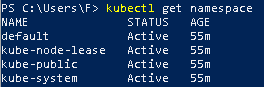

# Namespaces

In Kubernetes, **namespaces** provide a mechanism for isolating groups of resources within a single cluser. Names of resources need to be unique within a namespaces objects (e.g Deployments, Services, etc) and not for cluster-wide objects (eg: StorageClass, Nodes, PersistentVolumes, etc).

# When to Use Multiple Namespaces

Namespace are intented for use in enviroments with many users spread across multiple teams, or projects. For clusters with a few to tens of users, you shoud not need to create or think about namespace at all. Start using namespaces when you need the features they provide.

Namespaces provide a scope for names. Names of resources need to be unique within a namespace, but not across namespaces. Namespaces cannot be nested inside one other and each kubernetes resource can only be in one namespace.

Namespaces are a way to divide cluster resoirces between multiples users (via resource quota).

It is not necessary to use multiple namespaces to separate slightly different resources, such as different versions of the same software: use labels to sitinguish resources within the same namespace.

## Working with Namespaces

Creation and deletin of namespaces are described in the [Admin Guide documentation for namespaces.](https://kubernetes.io/docs/tasks/administer-cluster/namespaces/)

> **Note**: Avoid creating namespaces with the prefix kube-, since it is reserved for Kubernetes system namespaces.


### View namespaces
You can list the current namespaces in a cluster using:
```bash
kubectl get namespace
```


Kubernetes starts with four initial namespaces:

* `default` The default namespace for objects with no other namespace
* `kube-system` The namespace for objects created by the Kubernetes system
* `kube-public` This namespace is created automatically and is readable by all users (including those not authenticated). This namespace is mostly reserved for cluster usage, in case that some resources should be visible and readable publicly throughout the whole cluster. The public aspect of this namespace is only a convention, not a requirement.
* `kube-node-lease` This namespace holds Lease objects associated with each node. Node leases allow the kubelet to send heartbeats so that the control plane can detect node failure.

### Setting the namespaces for a request

To set the namespace for a current request, use the `--namespace` flag.

For example:
```bash
kubectl run nginx --image=nginx --namespace=<insert-namespace-name-here>
kubectl get pods --namespace=<insert-namespace-name-here>
```

### Setting the namespaces reference
You can permanently save the namespace for all subsequent kubectl commands in that context.
```bash
kubectl config set-context --current --namespace=<insert-namespace-name-here>
# Validate it
kubectl config view --minify | grep namespace:
```

## Namespaces and DNS

## Not All Objects are in a Namespace 
Most Kubernetes resources (e.g. pods, services, replication controllers, and others) are in some namespaces. However namespace resources are not themselves in a namespace. And low-level resources, such as nodes and persistentVolumes, are not in any namespace.

To see which Kubernetes resources are and aren't in a namespace:

```bash
# In a namespace
kubectl api-resources --namespaced=true

# Not in a namespace
kubectl api-resources --namespaced=false
```

## Automatic labelling

**FEATURE STATE**: Kubernetes 1.21 [beta] <br>
The Kubernetes control plane sets an immutable label `kubernetes.io/metadata.name` on all namespaces, provided that the `NamespaceDefaultLabelName` [feature gate](https://kubernetes.io/docs/reference/command-line-tools-reference/feature-gates/) is enabled. The value of the label is the namespace name.

## What's next
* Learn more about creating a new namespace.
* Learn more about deleting a namespace.

